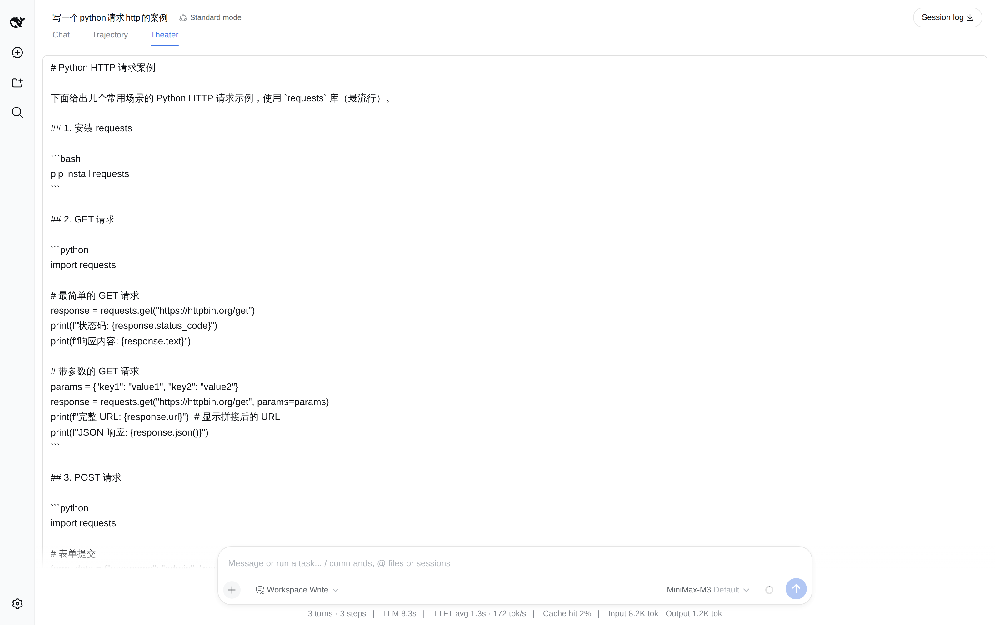
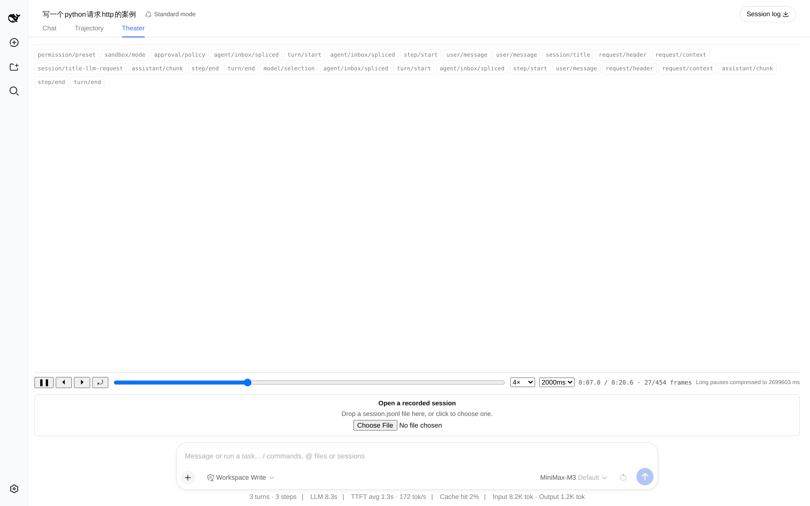
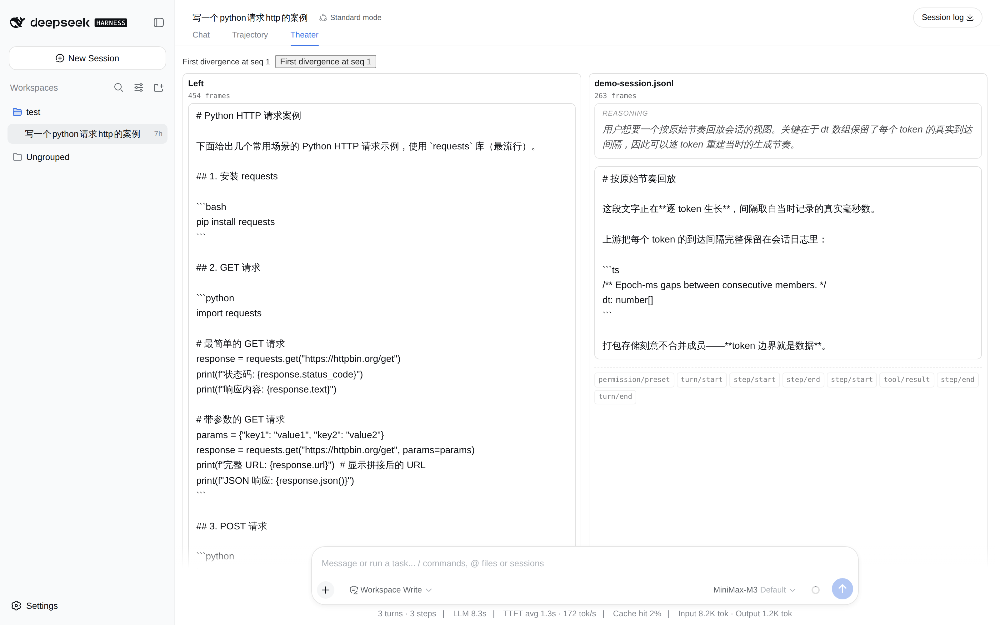

# dsh-replay-theater

[](https://github.com/topics/dsh-plugin)
[](#)

English | [中文](README.zh.md)

**Replay a [DeepSeek Harness](https://github.com/deepseek-ai/deepseek-harness) session at its original token cadence** — an in-app playback theater with play, pause, single-step, speed and seek.

Not a static timeline: the assistant's answer grows token by token, spaced by the real millisecond gaps recorded when it was generated.



<details>
<summary><b>More screenshots</b> — transport controls, and side-by-side comparison</summary>

**Transport bar and marker rail.** Play/pause, single-step, restart, scrub, speed, and a
"max pause" ceiling. Scalar events (`step/start`, `tool/result`, …) sit on their own rail, and
the bar states how much silence was compressed — playback alters timing, so it says so.



**Side-by-side comparison (v2).** Load a recorded `session.jsonl` next to the live one and the
theater reports where the two runs stop matching, with a seek coordinate for each side.



</details>


## Why this exists

Upstream keeps every token's real inter-arrival gap in the session log, and says why:

```ts
// packages/core/session/src/chunk-rows.ts:44
/** Epoch-ms gaps between consecutive members; length is one less than the member count. */
dt: number[]
```

> *"one entry per member, never joined — **token boundaries are data**"* — chunk-rows.ts:48

Packed storage deliberately does **not** join a run's members into one string, so the cadence survives. Nothing in the harness used that data. This plugin does.

## Install

```bash
dsh plugin --profile web add dsh-replay-theater
```

Or from a checkout:

```bash
dsh plugin --profile web add "github:ItBayMax/dsh-replay-theater#main"
```

The package declares `dsh.bundle`, so the CLI reconciles it into the profile's layer list automatically — no manual `cordis.patch.yml` edit. Restart `dsh web` and open a session: a **Theater** tab appears beside Chat and Trajectory.

## Use

| Control | Behavior |
|---|---|
| ▶ / ❚❚ | Play or pause. Playing at the end restarts from the beginning. |
| ⏴ / ⏵ | Step one frame (one token) back or forward. Stepping pauses. |
| ⤾ | Restart, paused, keeping the chosen speed. |
| Scrub | Seek to an absolute position. |
| Speed | 0.5× to 8×. |
| Max pause | Compress silences longer than this (200 ms … ∞). `∞` keeps true wall-clock cadence. |
| Load earlier history | Page one older window in. Playback keeps its position. |

When any silence was compressed, the transport bar says so and by how much. Playback alters the data's timing, so it tells you.

## What it replays

Everything the browser's session window holds: assistant text, reasoning, and tool-call arguments — each as its own stream — plus scalar events (`step/start`, `tool/result`, …) as markers.

**Tool calls show as accumulating JSON plus the tool name**, not as full tool cards. Cards are `ui-tool`'s job; this plugin is about cadence.

## Limits

- **No random access.** The dsh client cannot request an arbitrary sequence: history pages backwards only, one window at a time (`session.loadOlder()`), and a production tail page can hold hundreds of thousands of events. So the theater replays the **loaded window** and gives you an explicit "load earlier" action rather than silently pulling an entire log into the browser.
- **Long silences are compressed by default** (2000 ms ceiling). Set `∞` for true cadence.
- **Live sessions grow under you.** The window is followed, and playback keeps its position when frames are appended.
- **Types are mirrored, not imported.** `@deepseek-ai/dsh-api-session-controller` is not published to npm, so `src/core/wire.ts` and `src/client/dsh.ts` carry structural mirrors of the upstream shapes, each annotated with the `file:line` it was read from (pinned to dsh `0a53fb5` / `0.1.2-alpha.2`). They are structurally compatible, so swapping them for real imports later needs no call-site changes.

## Compatibility

Developed against **dsh `0.1.2-alpha.2`** (upstream commit `0a53fb5`). It reads only the public client surface — `session.eventSource` and `session.loadOlder()` — because upstream removed an entire client package (`client/runtime`) in 0.1.2; depending on internals is not survivable.

## Development

```bash
npm install
npm test          # 158 tests
npm run typecheck
```

The replay core (`src/core/`) is framework-free and dsh-free, so its rules are unit-tested without a browser or a harness checkout:

```bash
npx vitest run tests/timeline.spec.ts tests/player.spec.ts
```

Test fixtures come in two kinds, for a documented reason:

- **`tests/fixtures/synthetic.ts`** — hand-built records with exact `dt` arrays. Cadence assertions live here.
- **`tests/fixtures/corpus-*.json`** — derived from an upstream recorded session by `make-corpus-fixture.mjs`, to prove the wire mirror accepts real shapes. It cannot carry cadence assertions: the upstream corpus normalizes `seq`/`time` away, and the longest consecutive same-block delta run in all 118 snapshot sessions is 2 members.

See [`docs/`](docs/) for the architecture and per-phase implementation notes.

## Offline CLI

The replay core is framework-free, so the same functions the browser tab uses also work in a script:

```bash
npm run build
node scripts/replay-cli.mjs path/to/session.jsonl --frames 20
node scripts/replay-cli.mjs run-a.jsonl run-b.jsonl        # compare two runs
```

Comparing two upstream snapshots, for example, reports where they stop matching:

```
comparison: diverged at frame 14 (marker-type), left seq 15 / right seq 15
```

## License

MIT
