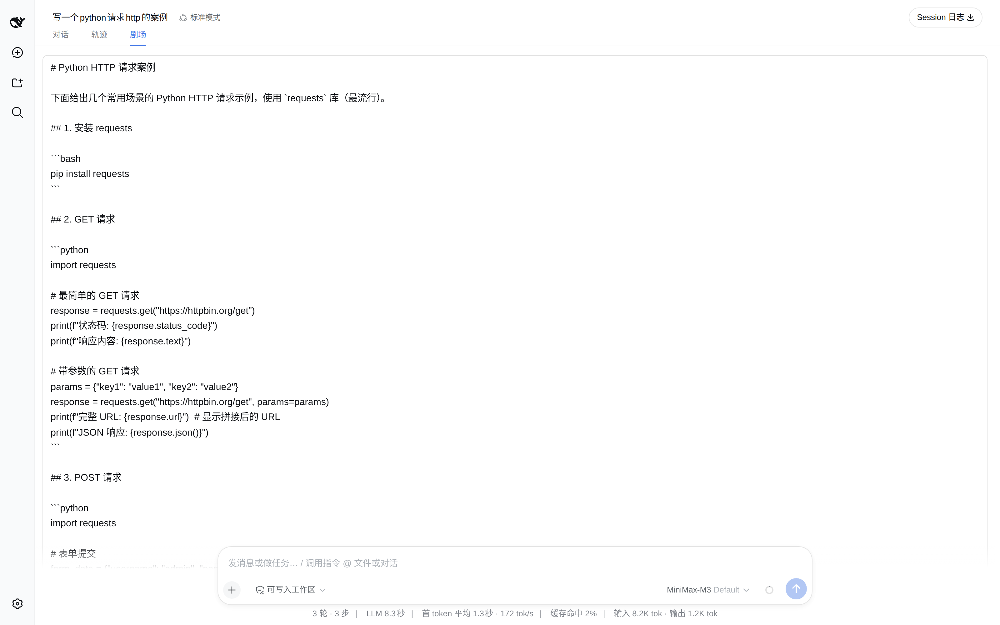
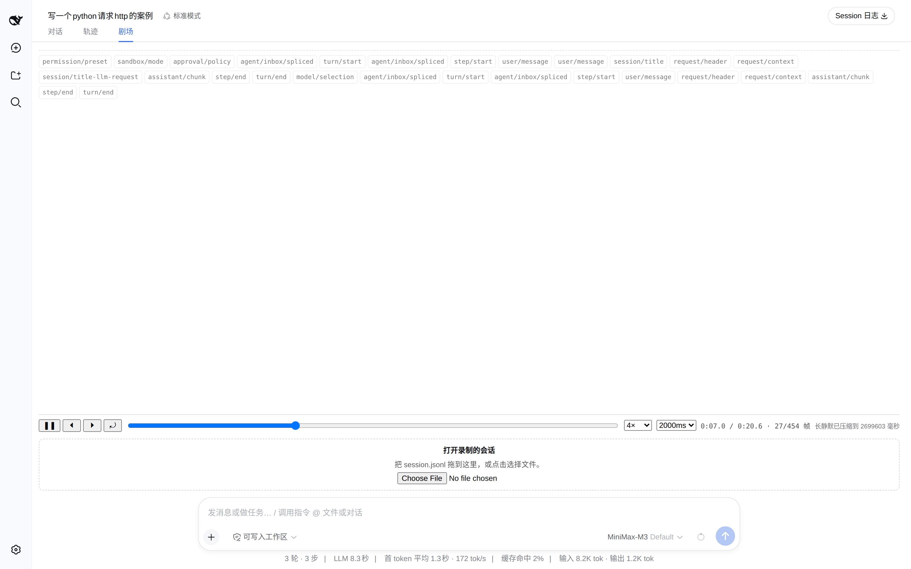
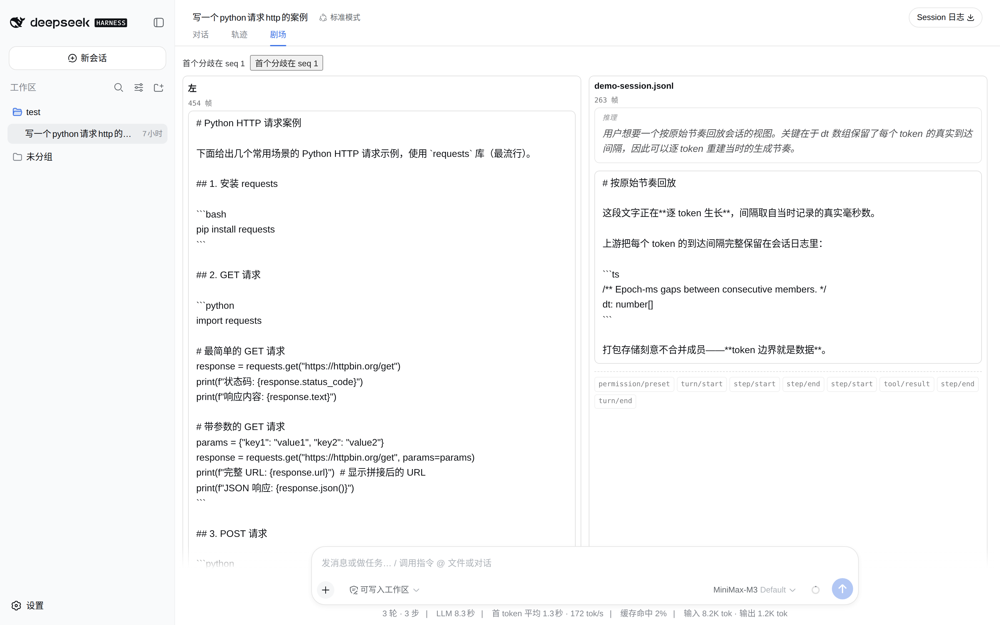

# dsh-replay-theater

[](https://github.com/topics/dsh-plugin)
[](#)

[English](README.md) | 中文

**按原始 token 节奏重演一次 [DeepSeek Harness](https://github.com/deepseek-ai/deepseek-harness) 会话**——站内播放剧场，支持播放、暂停、单步、倍速、拖拽跳转。

不是静态时间线：助手的回答一个 token 一个 token 地长出来，间隔就是当时生成时记录的真实毫秒数。



<details>
<summary><b>更多截图</b>——播放条与并排对比</summary>

**播放条与 marker 轨**。播放/暂停、单步、重播、拖拽跳转、倍速，以及"最长停顿"上限。
标量事件（`step/start`、`tool/result`…）单独成轨；压缩了多少静默会直接写在条上——
**回放改动了数据的时间，所以它必须告知**。



**并排对比（v2）**。把一份录制的 `session.jsonl` 与当前会话并排放，剧场会报出两次运行
从哪里开始不一致，并给出各自的跳转坐标。



</details>


## 为什么会有这个插件

上游把每个 token 的真实到达间隔完整保留在会话日志里，并明说这是刻意的：

```ts
// packages/core/session/src/types.ts:341-348
'assistant/message': {
  turn: number
  step: number
  message: AssistantMessage
  /** Exact timed model stream, compacted without joining delta boundaries. */
  stream: AssistantStreamRecord[]
  …
}
```

> *"**Lossless** compact representation of one model-stream attempt"* —— packages/llm/llm/src/assistant-stream.ts:1-2

一次落定的 attempt 把逐 token 间隔留在 `dt` 里，而**不把成员合并成一个字符串**，所以节奏在磁盘上得以保留。而 harness 里没有任何东西回放它。这个插件就是那个使用者。

## 安装

```bash
dsh plugin --profile web add dsh-replay-theater
```

或从仓库直装：

```bash
dsh plugin --profile web add "github:ItBayMax/dsh-replay-theater#main"
```

包里声明了 `dsh.bundle`，CLI 会自动把它并入 profile 的层列表——**不需要手改 `cordis.patch.yml`**。重启 `dsh web` 打开任一会话，Chat 与 Trajectory 旁边会出现 **剧场** 标签页。

## 使用

| 控件 | 行为 |
|---|---|
| ▶ / ❚❚ | 播放 / 暂停。已在末尾时按播放会从头重播 |
| ⏴ / ⏵ | 单步后退 / 前进一帧（一个 token）。单步会暂停 |
| ⤾ | 回到开头并暂停，保留当前倍速 |
| 进度条 | 跳转到绝对位置 |
| 倍速 | 0.5× 到 8× |
| 最长停顿 | 压缩超过该时长的静默（200ms … ∞）。选 `∞` 保留真实墙钟节奏 |
| 加载更早的历史 | 向前翻一个窗口，播放位置不丢 |

只要有静默被压缩，播放条就会显示压缩了多少毫秒。**回放改动了数据的时间，所以它必须告知**。

## 回放什么

浏览器会话窗口里的一切：助手正文、推理、工具调用参数（各自成流），以及标量事件（`step/start`、`tool/result`…）作为 marker。

**工具调用显示为累积的 JSON + 工具名**，不是完整工具卡片。卡片是 `ui-tool` 的职责，这个插件专注节奏。

## 边界

- **无随机访问**：dsh 客户端无法请求任意序号——历史只能向前翻页、一次一个窗口（`session.loadOlder()`），而生产环境单个尾页可达几十万事件。所以剧场回放**已加载的窗口**，并给一个显式的"加载更早"动作，而不是悄悄把整条日志拉进浏览器。
- **长静默默认被压缩**（上限 2000ms）。要真实节奏请选 `∞`。
- **实时会话会在你脚下增长**：窗口是被跟随的，追加帧时播放位置不会丢。
- **跳转坐标是 attempt 粒度**：自会话格式 v2 起，一次落定的 attempt 无论含多少 token 都**只占一个 seq**，所以分歧报告指向的是 attempt 而非 token；attempt 内部的顺序来自 stream 位置。
- **类型是镜像而非导入**：`@deepseek-ai/dsh-api-session-controller` 未发布到 npm，所以 `src/core/wire.ts` 与 `src/client/dsh.ts` 自持上游形状的结构化镜像，逐条标注读取自哪个 `file:line`（钉在 dsh `639ed01` / `0.2.0-rc.2`）。它们结构兼容，将来换成真 import 不需要改任何调用点。

## 兼容性

针对 **dsh `0.2.0-rc.2`**（上游 commit `639ed01`）开发。只读公开客户端面——`session.eventSource` 与 `session.loadOlder()`——因为上游会在小版本之间整包删除客户端代码，依赖内部实现活不长。

**两代磁盘格式都能读**。落定的 attempt 是一条 `assistant/message` / `assistant/attempt`，打包 run 放在 `data.stream` 里（格式 v2 及以后，当前是 v4）。generation 0 的日志——文件名是不带版本后缀的 `session.jsonl`——则是一个 run 一个打包行；离线解析器会把它提升成当前形状，所以旧文件照样能回放。

客户端专有的 `transient` 条目会被忽略：上游会用落定事件原子替换它们，两者都放会让每个 token 播两遍。

## 开发

```bash
npm install
npm test          # 165 个测试
npm run typecheck
```

回放核心（`src/core/`）零框架零 dsh 依赖，所以它的规则不需要浏览器或 harness checkout 就能单测：

```bash
npx vitest run tests/timeline.spec.ts tests/player.spec.ts
```

测试夹具分两种，理由有据：

- **`tests/fixtures/synthetic.ts`**——手工构造、`dt` 数组精确。节奏断言都在这里。
- **`tests/fixtures/corpus-*.json`**——由 `make-corpus-fixture.mjs` 从上游录制会话派生，用来证明 wire 镜像能吃真实形状。这份语料能证明什么、不能证明什么，在 0.2.0 上变了，以下为 `639ed01` 实测：
  - **形状：能**。173 个 `session.v3.jsonl` 快照，其中 168 个带 stream，共 526 段打包 run。run 内的 `time0` 与 `dt` 在归一化后**全部 526 段都还在**（400 个不同的 `time0` epoch 毫秒值），最长的一段 run 有 **2047** 个成员——插件要展开的那个形状，覆盖是够的。
  - **真实节奏：不能**。行级 `seq`/`time` 依然被剥掉（4343 行里 0 行保留），526 段 run 里有 373 段的 `dt` 全为零，而整个语料中最大的一个间隔只有 **156 ms**。这些会话是对着快速或打桩的模型录的，不存在"模型停下来想几十秒"那种节奏可供断言。计时测试因此走合成夹具。

架构与各阶段实现记录见 [`docs/`](docs/)。其中 01-06 是按 0.1.2 时期原样保留的
开发日志；当前线格式与本次 0.2.0 移植改了什么，见
[07-移植到 0.2.0](docs/07-%E7%A7%BB%E6%A4%8D%E5%88%B0-0.2.0.md)。

## 离线命令行

回放核心零框架依赖，所以浏览器标签页用的那些函数在脚本里同样可用：

```bash
npm run build
node scripts/replay-cli.mjs path/to/session.jsonl --frames 20
node scripts/replay-cli.mjs run-a.jsonl run-b.jsonl        # 对比两次运行
```

比如对比两份上游快照，会报出它们从哪里开始不一致：

```
comparison: diverged at frame 14 (marker-type), left seq 15 / right seq 15
```

## 许可

MIT
